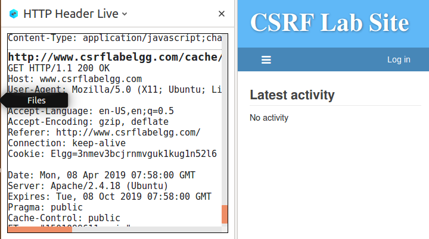
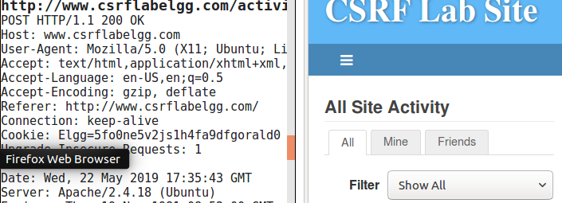
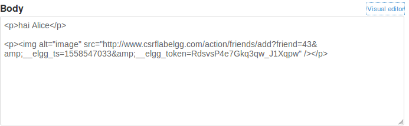
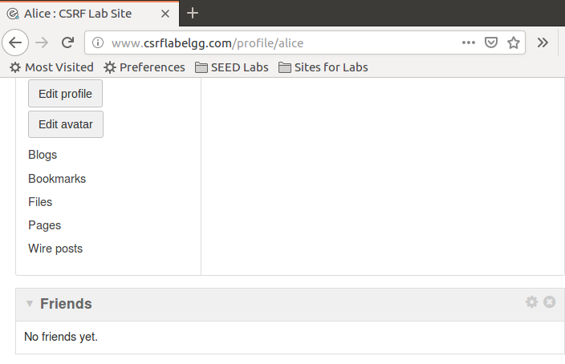
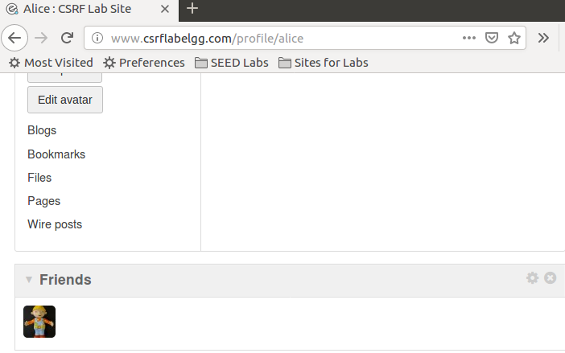
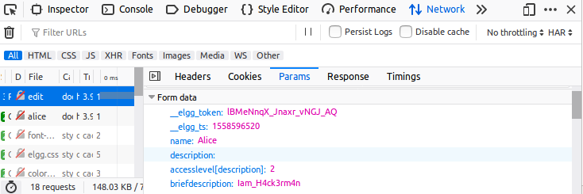
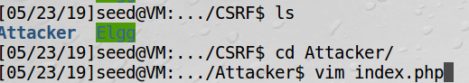
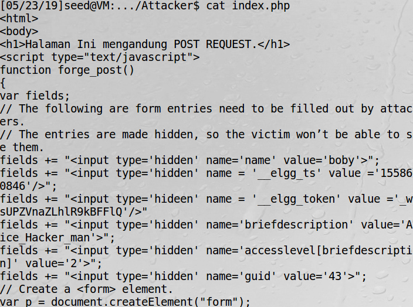
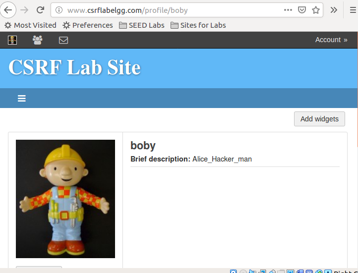

### SEEDLAB : CSRF by Dito Prabowo

***
#### 0x1 LAB TASK
##### Task 1: Observing HTTP Request.
Capture GET Request dan POST Request

GET Capture :

Post Capture :

##### Task 2: CSRF Attack using GET Request
Pertama kita login sebagai boby,lalu add friend alice dan kita akan mendapat link add friend boby dan alice :

http://www.csrflabelgg.com/action/friends/add?friend=42&__elgg_ts=1558547033&__elgg_token=RdsvsP4e7Gkq3qw_J1Xqpw

nah, kita bisa membuat link diatas untuk menambahkan boby sebagai teman alice otomatis. dengan link diatas diganti friend=43 (boby), pada akun boby buat postingan yang pada gambar disisipkan link diatas.

sebelum mengunjungi blog boby :

Sesudah mengunjungi blog boby :

##### Task 3: CSRF Attack using POST Request

Kita login dengan akun alice, kemudian kita caputer post ketika edit profile dan analisa.

Setelah kita tau apa aja yang perlu buat POST request, kita buat pada folder attacker di /var/www/CRSR/Attacker file php yang mengandung malicious code, kemudian suruh bob untuk membuka web : http://www.csrflabattacker.com

kemudian isi dengan script seperti pada pdf dan lengkapi

kemudian boby suruh mengunjungiweb nya.

Hasil :

Bob terganti profilenya

##### Task 4: Implementing a countermeasure for Elgg

Turn on countermeasure,

To turn on the countermeasure, please go to the directory /var/www/CSRF/
Elgg/vendor/elgg/elgg/engine/classes/Elgg and find the function gatekeeper in the
ActionsService.php file. In function gatekeeper() please comment out the "return true;"

Setelah di comment kemudian csrf tidak akan bekerja
